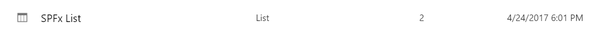

#
- `npm install --save-dev`# Bootstrap Slider Built with jQueryr v1.x and Boostrap v3.x and PnP-JS

## Summary
Sample bootstrap slider which pulls the slides from a list inside the SharePoint site. The list is automatically deployed once the app is installed in the SharePoint site.

## Applies to

* [SharePoint Framework Developer GA](http://dev.office.com/sharepoint/docs/spfx/sharepoint-framework-overview)
* [Office 365 developer tenant](http://dev.office.com/sharepoint/docs/spfx/set-up-your-developer-tenant)

## Solution

Solution|Author(s)
--------|---------
Pnp-JS Slider|Jiten Pramar/Akshay Panjwani 

## Version History

Version|Date|Comments
-------|----|--------
1.0|June,4th 2018|Initial Release

## Disclaimer
**THIS CODE IS PROVIDED *AS IS* WITHOUT WARRANTY OF ANY KIND, EITHER EXPRESS OR IMPLIED, INCLUDING ANY IMPLIED WARRANTIES OF FITNESS FOR A PARTICULAR PURPOSE, MERCHANTABILITY, OR NON-INFRINGEMENT.**

---

## Configuration Bliss
- clone this repo
- in write-manifests.json
 - fill in the correct CDN path
- in the command line run:
 - `npm install --save-dev`
 - `npm install sp-pnp-js --save`
 - `gulp bundle --ship`
 - `gulp package-solution --ship`
- in your SharePoint Online tenant app store install the app
- add your assets to the specified path in the write-manifests.json
 - the assets are found in the **temp/deploy** folder
- add the app to your SharePoint Online site
 - When the app is finished installing you should see a **SPFx List** in the **Site Contents** of the site
 
- Add items to the **SPFx List** inorder for slides to display in the webpart

